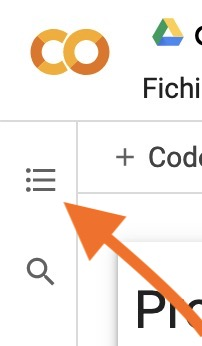
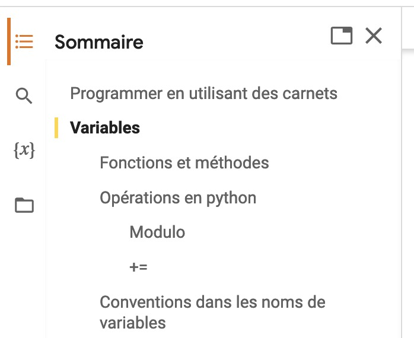

# 🚸 00.Tutoriels


_**En signant l'entente d'évaluation, vous acceptez que je rende publics vos travaux sur le**_ [_**compte Github du programme**_](https://github.com/Journalisme-UQAM) _**(j'ignore encore ceux que je prendrai; il est possible que n'en prenne aucun, faute de temps).**_


Seront déposés ici, tout au long de la session, les carnets que je vais réaliser en classe avec vous, ainsi que d'autres éléments de documentation, au besoin.

Pour voir la table des matières de ces carnets, cliquez sur cette icône de menu, dans la barre de gauche.

<figure><figcaption></figcaption></figure>

<figure><figcaption></figcaption></figure>

* Exemples des [travaux réalisés par les personnes qui vous ont précédé](https://github.com/Journalisme-UQAM/) (dans le compte Github du programme de journalisme).
* Mini tutoriel sur le [_markdown_](https://colab.research.google.com/drive/1nQf6fBVpfhkJxOMGJw\_9G1lwwZBxdczU?usp=sharing), ce « langage » qui permet de formater facilement du texte en ligne, tel qu'il peut être utilisé dans Colab.

### Python

* Python 1 (cours du 19 janvier 2023). Voici [le carnet que nous avons réalisé en classe](https://colab.research.google.com/drive/1QG-qvMPWkyvVI5eyRwGLX-MRg0jeLEol?usp=sharing), agrémenté de beaucoup plus de commentaires... et même avec quelques notions supplémentaires utiles pour votre devoir1.

