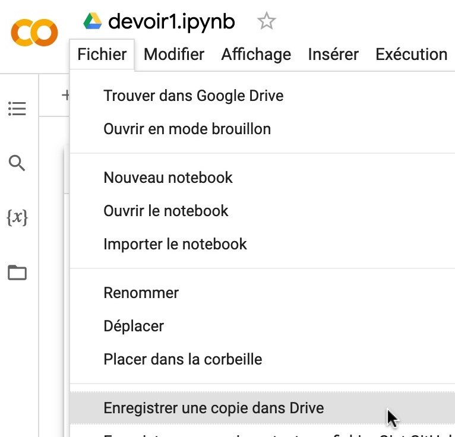

# 🛠 Travaux

Les travaux à remettre ont été mentionnés brièvement dans les pages précédentes. Je vous donne, ci-dessous, un peu plus de détails sur chacun de ces éléments d'évaluation.

Liens directs vers les devoirs:

* [Devoir 1](travaux.md#devoir-1)
* Devoir 2
* Devoir 3
* Devoir 4
* Devoir 5

### Devoir 1 - Triptyque (10 points) 

Rendez-vous dans [ce carnet que j'ai créé pour vous](https://colab.research.google.com/drive/1E8fnf7aneQj1uc3TWaE59fYMeylyPxuB?usp=sharing).

Assurez-vous d'abord d'en créer une copie dans votre Drive.

<figure><figcaption></figcaption></figure>

Répondez ensuite à toutes les questions que je vous y pose.

Le [carnet de mes notes du cours python 1](https://colab.research.google.com/drive/1QG-qvMPWkyvVI5eyRwGLX-MRg0jeLEol?usp=sharing) peut vous aider.

Quand vous avez terminé, téléchargez votre carnet en **format .ipynb** sur votre ordinateur.

Remettez votre carnet (**devoir1.ipynb**) dans Moodle.

Tombée : 23h59, le lundi 23 janvier 2023.

### Devoir 2 (10 points) 

#### Étape 1

Créez un carnet dans Colab. Appelez-le **devoir2.ipynb**.

#### Étape 4 (une de moins!)

À partir du menu «Fichier» de l'interface Colab, téléchargez votre carnet en format `.ipynb` sur votre ordinateur.

Vous me remettez votre carnet (**devoir2.ipynb**) dans Moodle. Il n'est pas nécessaire de joindre le fichier CSV que votre code produira.

Tombée : 23h59, le lundi 6 février 2023

### Devoir 3 (15 points) - Moissonnage 

Votre carnet doit:

* moissonner un site web ou un API de votre choix (allez-y en fonction de vos intérêts: sports, culture, politique internationale, mode, etc.) et
* produire un CSV avec les données (textes, nombres, dates, montants, coordonnées, URL, images, etc.) que vous y recueillerez,
* m'expliquer ce que fait votre code,
* m'expliquer pourquoi ces données vous intéressent.

Ce CSV devra contenir au moins 100 lignes et 5 colonnes. Consultez-moi si cela est différent, peut-être que votre site ou API est structuré de façon telle qu'il peut représenter un défi particuliier.

Si vous avez des difficultés, n'hésitez pas à me demander de l'aide. :rotating\_light:

Vous me remettez votre carnet (**devoir3.ipynb**) dans Moodle.

Tombée : 23h59, le lundi 13 février 2023.

### Devoir 4 (10 points) 

Vous me remettez votre carnet (**devoir4.ipynb**) dans Moodle.

Tombée : 23h59, le lundi 6 mars 2023.

### Devoir 5 (10 points) - Description à venir 

Vous me remettez votre carnet (**devoir5.ipynb**) dans Moodle.

Tombée : 23h59, le lundi 27 mars 2023.

### Projet final (30 points)

Pour votre projet final, qui est un travail **individuel**, vous avez deux options. Vous pouvez faire :

* un <mark style="background-color:blue;">**reportage**</mark> ou
* un <mark style="background-color:green;">**outil**</mark>

Si vous choisissez l'**option **<mark style="background-color:blue;">**reportage**</mark>, vous pouvez le faire sur un **sujet** de votre choix (conditionnel à mon approbation). Vous avez aussi le choix de la **forme** de ce reportage : il peut s'agir d'un article, d'un reportage radio, d'un reportage télé ou d'un reportage web.

La production de ce reportage ou de cet outil devra impliquer de la programmation en Python pour moissonner et/ou traiter et/ou visualiser des données.

Votre reportage devra également comprendre **au moins une entrevue** avec un expert, un témoin, ou tout autre intervenant en mesure de valider ou d'incarner ce que racontent les données dans votre reportage.

L'**option **<mark style="background-color:green;">**outil**</mark> peut prendre diverses formes. Il peut s'agir d'un robot Instagram, d'un outil qui automatise des tâches fastidieuses dans une salle de presse, etc. Si vous vous êtes déjà dit : « Hé! Ce serait cool si on pouvait faire telle chose! » Eh bien, allez-y! Faites-la! _W kapab_!

### _Making-of_ (10 points)

Quelle que soit la forme que prendra votre travail final, il devra être accompagné d'un texte **(en format PDF)** qui :

* compte entre 3 000 et 5 000 caractères;
* comprend des liens vers **toutes** les sources de documentation qui vous ont aidées en cours de route;
* comprend des hyperliens vers **toutes** les sources de vos données et/ou carnets que vous avez utilisés (s'il y a lieu);
* décrit votre démarche :
  * Pourquoi ce sujet?
  * Quels outils ou quelles technologies avez-vous utilisés?
  * Pourquoi les avoir choisi(e)s?
  * Comment vous ont-ils(elles) servi?
  * Quels problèmes avez-vous éprouvés (s'il y a lieu).

Votre document PDF doit être accompagné, s'il y a lieu, de tous les carnets que vous avez écrits, et/ou de tous les autres fichiers pertinents **(.py, .csv, .ods, .xls, .sql ou autres)** que vous avez récoltés ou dont vous vous êtes servis.

Vous mettez tout cela dans Moudeul avant la fin du dernier cours (12h30, le 20 avril 2023) _por favor_.
